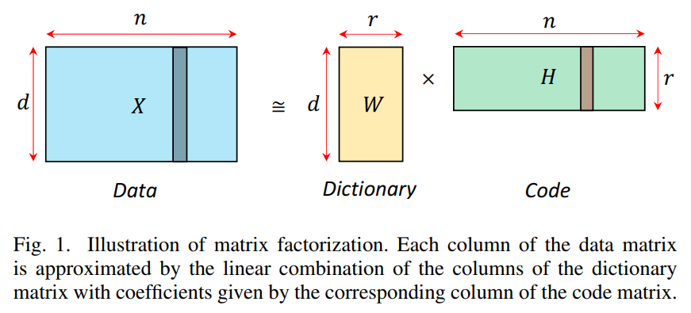
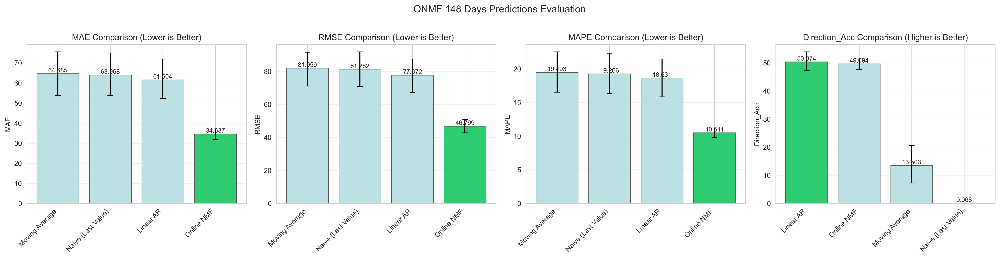

<p align="center">
  
  
  
  <a href="https://deepwiki.com/Omar-Ar1/onmf-timeseries"></a>
</p>

# Online NMF for Time-Series Forecasting


This repository contains a reproducible implementation of the Online Non-Negative Matrix Factorization (Online NMF) framework introduced by Lyu et al. (2020) for multi-dimensional time-series forecasting. The codebase focuses on financial markets, but the learning pipeline is agnostic to the data domain as long as observations remain non-negative.

> Lyu, H., Strohmeier, C., Menz, G., & Needell, D. (2020).  
> *COVID-19 Time-series Prediction by Joint Dictionary Learning and Online NMF*. arXiv:2004.09112.
> 
<p align="center">
  
</p>


---

## Highlights

- **Online dictionary learning**: hybrid minibatch + online updates (Algorithms 3 & 1 from the paper) implemented in `src/onmf/model.py`.
- **Multi-asset preprocessing**: automated Yahoo Finance loader, returns computation, scaling, and non-negativity enforcement (`src/onmf/preprocessing.py`).
- **Forecasting utilities**: one-step-ahead reconstruction, atom-importance metrics, and rich visualization helpers (`src/onmf/visualization.py`).
- **Baselines & evaluation**: Naive, Moving Average, Ridge-based Linear AR, ARIMA, and block-bootstrap confidence intervals (`src/onmf/baselines.py`, `src/onmf/utils.py`).
- **Reproducible example**: `examples/financial_markets/run_analysis.py` orchestrates the full experiment from data download to plots and CSV metrics.
- **Fully PyTorch implementation**: GPU-ready and optimized for large-scale applications, extending the original NumPy prototype.

---

## Installation

```bash
git clone https://github.com/Omar-Ar1/onmf-timeseries.git
cd onmf-timeseries

python -m venv .venv
source .venv/bin/activate          # Windows: .venv\Scripts\activate
pip install -e .                   # core package
pip install -e ".[dev]"            # optional: tests, linting, notebooks
```

Core dependencies are defined in `pyproject.toml` / `requirements.txt`. GPU acceleration is automatic when CUDA is available.

---

## Quick Start

```python
import torch
from onmf import OnlineNMF
from onmf.preprocessing import prepare_financial_data

tickers = ["AAPL", "GOOGL", "MSFT"]
X_train, X_test, _, metadata = prepare_financial_data(
    tickers=tickers,
    start="2020-01-01",
    features=["Close", "Volume"],
    compute_returns=False,
    train_ratio=0.9,
)

model = OnlineNMF(r=10, k=6, batch_size=20, N=100, max_iter=800)
model.fit(
    X_train,
    lambda_=1.0,
    beta=4.0,
    lambda_minB=3.0,
    beta_minB=1.0,
)

prediction = model.predict(X_train, lambda_pred=0.5)
print(prediction.shape)            # (d,)
```

The helper `prepare_financial_data` ensures the tensors are scaled, split, and non-negative. For other domains, provide your own preprocessing pipeline as long as the final tensors are shaped `(T, d)` with `T >= N`.

---

## Example Pipeline

```bash
cd examples/financial_markets
python run_analysis.py --config config.yaml
```

`run_analysis.py` performs:

1. Data download & preprocessing (`prepare_financial_data`)
2. Online NMF training and rolling forecasts
3. Baseline model comparisons
4. Metrics + bootstrap CIs + plots
5. Saving artifacts to `results/financial_markets/<run_id>/`

Modify `examples/financial_markets/config.yaml` to change tickers, features, training horizon, or ONMF hyperparameters.

---

## Results Snapshot

<p align="center">
  
</p>


The best experiment stored in `results/financial_markets/best_result/` achieved the following metrics on AAPL close-price forecasting (lower is better except Direction Accuracy). We forecast the next 148 days autoregressively:

| Model               | MAE   | RMSE  | MAPE  | Direction Acc (%) |
|---------------------|-------|-------|-------|-------------------|
| **Online NMF**      | 34.64 | 46.80 | 10.51 | 49.69             |
| Naive (Last Value)  | 63.97 | 81.28 | 19.27 | 0.07              |
| Moving Average      | 64.69 | 81.96 | 19.49 | 13.50             |
| Linear AR (Ridge)   | 61.60 | 77.67 | 18.63 | 50.37             |

Bootstrap 95% confidence intervals (see `metrics_confidence_intervals.csv`) show non-overlapping bounds for MAE/RMSE/MAPE between Online NMF and the baselines, underlining the robustness of the improvements.

---

## Repository Layout

```
onmf-timeseries/
├── docs/                      # Extended documentation (user guide, API notes)
├── examples/financial_markets # Full demonstration pipeline
├── notebooks/                 # Exploratory analysis notebooks
├── results/                   # Generated experiment artifacts
├── src/onmf/                  # Package source (model, preprocessing, viz, utils)
├── tests/                     # Pytest suites for model + preprocessing
├── pyproject.toml             # Build metadata
├── requirements.txt           # Pinned runtime dependencies
└── README.md                  # You are here
```

---

## Documentation

- `docs/user_guide.md`: step-by-step walkthrough of the training/evaluation loop.
- `docs/api_reference.md`: module summaries for high-level usage.
- - `docs/algorithms.md`: detailed walkthrough of the implemented algorithms..
- `examples/financial_markets/README.md`: detailed description of the experiment script and configuration knobs.

New contributors should start with the user guide, then inspect `src/onmf/model.py` for the algorithmic details.

---

## Development & Testing

```bash
pip install -e ".[dev]"
pytest tests/                     # run unit tests
python -m black src tests         # formatting
python -m isort src tests
```

Tests cover initialization, fitting, sparse-code updates, device handling, and preprocessing utilities. Please extend the suite when adding new features.

---

## Citation

```bibtex
@article{lyu2020covid19,
  title={COVID-19 Time-series Prediction by Joint Dictionary Learning and Online NMF},
  author={Lyu, Hanbaek and Strohmeier, Christopher and Menz, Georg and Needell, Deanna},
  journal={arXiv preprint arXiv:2004.09112},
  year={2020}
}
```

---

## License

Distributed under the MIT License. See `LICENSE` for details.
